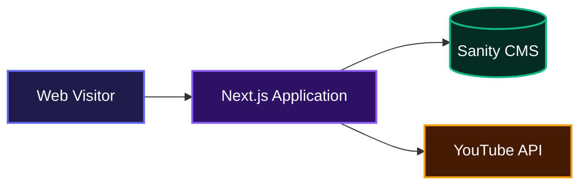
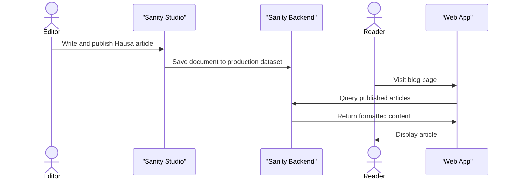

# TechInHausa

TechInHausa helps educators and learners bridge the digital divide by providing technology and artificial intelligence education entirely in the Hausa language. It aggregates video lessons, manages technical blog posts, and standardizes tech terminology translations to make modern digital skills accessible to a wider audience.

## System Architecture



## Installation

Clone the repository and install the dependencies:

```bash
git clone <repository-url>
cd techinhausa
npm install
```

Create a local environment file by copying the example provided in the repository:

```bash
cp .env.local.example .env.local
```

Fill in the required environment variables in your new `.env.local` file:

```text
NEXT_PUBLIC_SANITY_PROJECT_ID=your_sanity_project_id
NEXT_PUBLIC_SANITY_DATASET=production
YOUTUBE_API_KEY=your_youtube_api_key
YOUTUBE_CHANNEL_ID=your_youtube_channel_id
```

## Usage

Start the local development server:

```bash
npm run dev
```

Open your browser and navigate to `http://localhost:3000` to view the application.

To manage content, authors, and blog posts, navigate to the embedded content studio at `http://localhost:3000/studio`. The studio runs fully on the client side and provides a complete interface for drafting and publishing articles.

## Features

*   **Video Aggregation**: Pulls and displays educational tech videos directly from YouTube so learners always have access to the latest content.
*   **Content Management System**: Includes an embedded Sanity Studio dashboard that allows editors to write, format, and publish technical articles natively in Hausa.
*   **Technical Glossary**: Provides a centralized dictionary that translates common tech and AI terms into standardized Hausa equivalents.
*   **Research Repository**: Hosts academic papers and research findings related to tech education in local languages.



## Technologies Used

*   TypeScript
*   React
*   Next.js
*   Tailwind CSS
*   Sanity CMS
*   PortableText

## Author Info

*   **Founder**: Ibrahim Zubairu (Malamiromba)
*   **Organization**: Malamiromba Ltd.

## Badges

[](https://www.typescriptlang.org/)
[](https://reactjs.org/)
[](https://nextjs.org/)
[](https://tailwindcss.com/)
[](https://www.sanity.io/)

[](https://dokugen.samueltuoyo.com)
